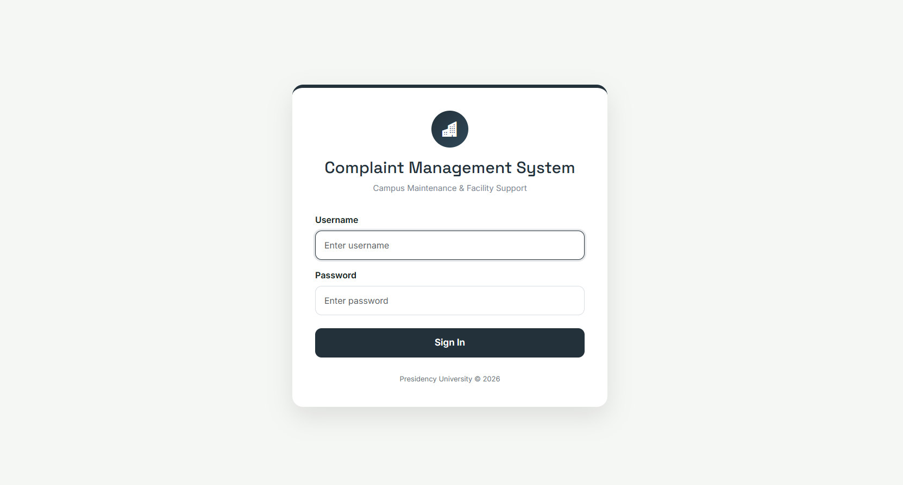
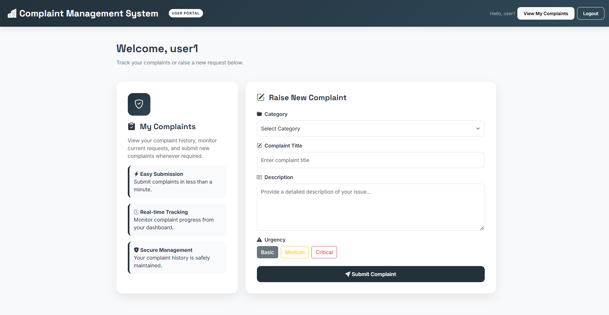
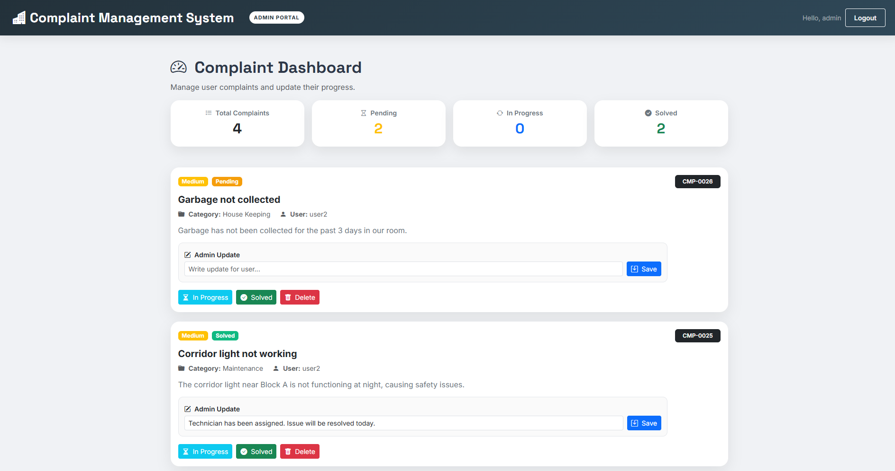

# Complaint Management System 
### Java Servlets • JSP • JDBC • MySQL • Bootstrap 5

A web-based complaint management system built using Java Servlets, JSP, JDBC, and MySQL. It enables students to submit and track complaints while providing administrators with a centralized dashboard to manage complaints, update status, and add remarks.


---

## 📸 Screenshots

The following screenshots showcase the login interface, student dashboard, and administrator dashboard.

### 🔐 Login Page



### 👨‍🎓 User Dashboard



### 👨‍💼 Admin Dashboard



---


## Tech Stack

| Layer | Technology |
| :--- | :--- |
| Frontend | JSP, Bootstrap 5, Bootstrap Icons, HTML/CSS |
| Backend | Java Servlets |
| Database | MySQL with JDBC |
| Server | Apache Tomcat |
| IDE | Eclipse |

---

## Features

### 👨‍🎓 Student Features

- Secure login using session management
- Submit complaints with category and urgency level
- View personal complaint history
- Track complaint status (Pending, In Progress, Solved)
- View admin remarks and updates
- Delete submitted complaints

### 👨‍💼 Admin Features

- Secure admin login
- View all complaints
- Dashboard with complaint statistics
- Update complaint status
- Add remarks for students
- Delete complaints
- Session-based role authorization

### ⚙️ Technical Highlights

- MVC architecture (Servlets + JSP)
- JDBC integration with MySQL
- Role-based authentication and session management
- Complaint analytics dashboard
- Responsive Bootstrap 5 interface


---

## 🗄️ Database Schema

### `login`
| Column | Type | Description |
|---|---|---|
| username | VARCHAR (PK) | Unique login identifier |
| password | VARCHAR | User password |
| role | ENUM | `admin` or `user` |

### `complaints`
| Column | Type | Description |
|---|---|---|
| id | INT (PK) | Auto-increment complaint ID |
| title | VARCHAR | Short complaint title |
| description | TEXT | Detailed complaint content |
| category | VARCHAR | Complaint category |
| urgency | VARCHAR | Urgency level (Low / Medium / High) |
| status | VARCHAR | `Pending` / `In Progress` / `Solved` |
| created_by | VARCHAR | FK → login.username |
| admin_remark | TEXT | Admin's response note |

---

## 🚀 Getting Started

**1. Clone the repository**
```bash
git clone https://github.com/Shwetha8730/ComplaintSystem1.git
```

**2. Set up the database**

Open MySQL Workbench and run:

```sql
CREATE DATABASE complaint_db;
USE complaint_db;

CREATE TABLE login (
  username VARCHAR(50) PRIMARY KEY,
  password VARCHAR(50),
  role ENUM('admin', 'user')
);

CREATE TABLE complaints (
  id INT AUTO_INCREMENT PRIMARY KEY,
  title VARCHAR(100),
  description TEXT,
  category VARCHAR(50),
  urgency VARCHAR(20),
  status VARCHAR(20) DEFAULT 'Pending',
  created_by VARCHAR(50),
  admin_remark TEXT,
  FOREIGN KEY (created_by) REFERENCES login(username)
);
```

**3. Import into Eclipse**
- `File → Import → General → Existing Projects into Workspace`
- Select the project folder → Finish

**4. Deploy on Tomcat**
- Right-click project → `Run As → Run on Server`
- Select Apache Tomcat v9.0 → Finish

**5. Open in browser**
```
http://localhost:8181/ComplaintSystem1/jsp/login.jsp
```

---

## 🔑 Test Accounts

> Passwords are set directly in the MySQL `login` table.

| Role | Username |
|---|---|
| Admin | `admin` |
| User | `user1` |
| User | `user2` |

---

## 📁 Project Structure

```text
ComplaintSystem1/
│
├── screenshots/
│   ├── login.png
│   ├── user-dashboard.png
│   └── admin-dashboard.png
│
├── src/
│   └── main/
│       ├── java/
│       │   ├── controller/
│       │   │   ├── AddComplaintServlet.java
│       │   │   ├── DeleteComplaintServlet.java
│       │   │   ├── LoginServlet.java
│       │   │   ├── LogoutServlet.java
│       │   │   ├── UpdateRemarkServlet.java
│       │   │   ├── UpdateStatusServlet.java
│       │   │   └── ViewComplaintServlet.java
│       │   │
│       │   └── util/
│       │       └── DBConnection.java
│       │
│       └── webapp/
│           ├── css/
│           │   └── style.css
│           │
│           ├── jsp/
│           │   ├── login.jsp
│           │   ├── home.jsp
│           │   └── view.jsp
│           │
│           ├── META-INF/
│           └── WEB-INF/
│               └── web.xml
│
├── build/
├── README.md
└── Referenced Libraries
```

---

## 👩‍💻 Author

 **Shwethashree S**
 
 Information Science & Engineering Student 
  

**Technologies:** Java • JSP • Servlets • JDBC • MySQL • Bootstrap 5 • Apache Tomcat
